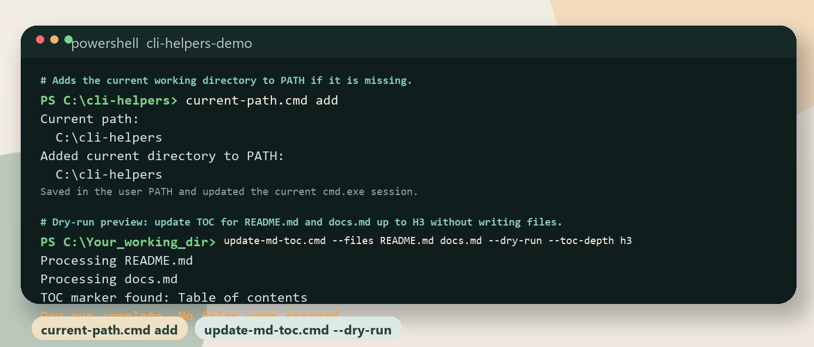

# Command-line helper scripts for common local development workflows.

<p align="center">
  
</p>
Small Windows CMD, PowerShell, and bash helpers for common local development tasks.

# Table of contents

- [Command Line Utilities](#command-line-utilities)
  - [Checks, lists, adds, or removes the current directory in `PATH`.](#checks-lists-adds-or-removes-the-current-directory-in-path)
  - [Shows, grants, or removes Windows file access permissions.](#shows-grants-or-removes-windows-file-access-permissions)
- [SSH / Remote Utilities](#ssh-remote-utilities)
  - [Copies a project folder to a remote server via SSH/scp.](#copies-a-project-folder-to-a-remote-server-via-sshscp)
- [Git Utilities](#git-utilities)
  - [Shows or updates global Git user name and email.](#shows-or-updates-global-git-user-name-and-email)
  - [Prints the current Git branch name.](#prints-the-current-git-branch-name)
  - [Shows all Git stashes with additional stash details.](#shows-all-git-stashes-with-additional-stash-details)
  - [Pulls the latest changes for a Git branch and optionally builds.](#pulls-the-latest-changes-for-a-git-branch-and-optionally-builds)
  - [Merges one Git branch into another and pushes the result.](#merges-one-git-branch-into-another-and-pushes-the-result)
  - [Runs a Git command across all matching subfolders.](#runs-a-git-command-across-all-matching-subfolders)
- [Markdown Utilities](#markdown-utilities)
  - [Creates or updates TOC in MD (Markdown) files from the command prompt.](#creates-or-updates-toc-in-md-markdown-files-from-the-command-prompt)
  - [Creates or updates TOC in MD (Markdown) files with PowerShell.](#creates-or-updates-toc-in-md-markdown-files-with-powershell)
  - [Creates or updates TOC in MD (Markdown) files with bash (Android / Linux).](#creates-or-updates-toc-in-md-markdown-files-with-bash-android-linux)
- [Python Utilities](#python-utilities)
  - [Activates the local Python virtual environment.](#activates-the-local-python-virtual-environment)
  - [Creates a local Python virtual environment in `.venv`.](#creates-a-local-python-virtual-environment-in-venv)
  - [Installs Python requirements into the local virtual environment.](#installs-python-requirements-into-the-local-virtual-environment)
  - [Installs Python requirements with the system `pip3`.](#installs-python-requirements-with-the-system-pip3)
  - [Starts Jupyter Notebook in the current directory.](#starts-jupyter-notebook-in-the-current-directory)
  - [Starts Qodo in UI mode.](#starts-qodo-in-ui-mode)
- [Other Utilities](#other-utilities)

# Command Line Utilities

## Checks, lists, adds, or removes the current directory in `PATH`.

Small helpers for working with the current directory in `PATH`.
Use them when you want to quickly check whether the current folder is already available from the command line, inspect the active `PATH`, or add or remove the folder from `PATH`.

Files: `current-path.cmd`, `current-path.sh`

General form:

```bat
:: Windows CMD / BAT
current-path.cmd [list|add|delete]
```

```bash
# Linux / bash
./current-path.sh [list|add|delete]
```

Parameters:
- No parameter: Checks whether the current working directory is already present in the current `PATH`.
- `list`: Prints the current `PATH` entries one per line and shows which environment they were read from.
- `add`: Adds the current working directory to persistent `PATH` settings if it is missing.
- `delete`: Removes the current working directory from persistent `PATH` settings if it is present.
- Output: The scripts print the current working directory first so it is clear which path is being checked.

Examples:

```bat
:: Windows CMD / BAT
current-path.cmd
```

```bat
:: Windows CMD / BAT
current-path.cmd add
```

Linux note:
- Use `source ./current-path.sh add` or `source ./current-path.sh delete` when you need the current shell session to receive the updated `PATH` immediately. Without `source`, only future shells will pick up the persistent change.


## Shows, grants, or removes Windows file access permissions.

File: `file-access.cmd`

Wraps `icacls` for common permission tasks on a single file.
Use it to inspect the current ACL, grant access to the current user and system accounts, remove a specific account, or apply the standard SSH private key fix in one step.

General form:

```bat
:: Windows CMD / BAT
file-access.cmd <file> [/fix-ssh-access | /grant <perms> | /remove <user>]
```

Parameters:
- `<file>`: Required. Path to the target file.
- No second argument: Print the current permissions with `icacls`.
- `/fix-ssh-access`: Remove inheritance, strip `BUILTIN\Users` and `Everyone`, and grant Full access to the current user, `SYSTEM`, and `Administrators`. Use this when SSH reports *"Bad permissions … BUILTIN\Users"*.
- `/grant <perms>`: Remove inheritance and grant the specified mask to the current user, `SYSTEM`, and `Administrators`. Masks: `F` (Full), `M` (Modify), `RX` (Read+Execute), `R` (Read).
- `/remove <user>`: Remove all ACL entries for the named account (e.g. `"BUILTIN\Users"`, `"Everyone"`).

Examples:

```bat
:: Windows CMD / BAT
file-access.cmd %USERPROFILE%\.ssh\id_rsa
```

```bat
:: Windows CMD / BAT
file-access.cmd %USERPROFILE%\.ssh\id_rsa_2 /fix-ssh-access
```

```bat
:: Windows CMD / BAT
file-access.cmd %USERPROFILE%\.ssh\id_rsa /grant F
```

```bat
:: Windows CMD / BAT
file-access.cmd %USERPROFILE%\.ssh\id_rsa /remove "BUILTIN\Users"
```


# SSH / Remote Utilities

## Copies a project folder to a remote server via SSH/scp.

Files: `copy-ssh-remote.cmd`, `copy-ssh-remote.sh`

Verifies local folder, SSH key, and remote connectivity, then copies the folder with `scp -r`.
Without `/copy` (or `--copy`) the script performs a connectivity check only.
Supports two modes: **config file** (named profiles in a `*.remote.ini` file) or **inline** (all connection details passed directly as parameters, no config file needed).

General form:

```bat
:: Windows CMD / BAT — config file mode
copy-ssh-remote.cmd [/config:file.ini] [/profile:name] [/check|/copy|/list]
```

```bat
:: Windows CMD / BAT — inline mode (no config file)
copy-ssh-remote.cmd /user:name /server:host /local_dir:path /remote_dir:path [/ssh_key:path] [/copy]
```

```bash
# Linux / bash — config file mode
./copy-ssh-remote.sh [--config=file.ini] [--profile=name] [--check|--copy|--list]
```

```bash
# Linux / bash — inline mode (no config file)
./copy-ssh-remote.sh --user=name --server=host --local_dir=path --remote_dir=path [--ssh_key=path] [--copy]
```

Parameters:
- No arguments: check mode using the first `*.remote.ini` in the current folder and the default profile.
- `/config:file.ini` / `--config=file.ini`: Optional. Path to the config file.
- `/profile:name` / `--profile=name`: Optional. Profile to use. Defaults to `default_profile` in config.
- `/user:name` / `--user=name`: Inline mode. SSH user name.
- `/server:host` / `--server=host`: Inline mode. SSH server host.
- `/ssh_key:path` / `--ssh_key=path`: Optional. Path to SSH private key.
- `/local_dir:path` / `--local_dir=path`: Inline mode. Local folder to copy.
- `/remote_dir:path` / `--remote_dir=path`: Inline mode. Remote destination path.
- `/deploy_hint:cmd` / `--deploy_hint=cmd`: Optional. Command shown after copy as a reminder.
- `/check` / `--check`: Optional. Verify connectivity without copying (default mode).
- `/copy` / `--copy`: Optional. Run the actual `scp` copy after checks pass.
- `/list` / `--list`: Optional. Print all available profiles and exit.

Config file format (save as `*.remote.ini`, e.g. `copy-remote.remote.ini`; excluded from git):

```ini
default_profile=my-project

[my-project]
description=My Project - myserver.com
user=myuser
server=myserver.com
ssh_key=C:\Users\Me\.ssh\id_rsa
local_dir=C:\Projects\my-project
remote_dir=/home/myuser/my-project
deploy_hint=cd /home/myuser/my-project && docker compose up -d

[another-project]
description=Another Project - myserver.com
user=myuser
server=myserver.com
ssh_key=C:\Users\Me\.ssh\id_rsa
local_dir=C:\Projects\another-project
remote_dir=/home/myuser/another-project
```

Examples:

```bat
:: Windows CMD / BAT — check connectivity (default)
copy-ssh-remote.cmd
```

```bat
:: Windows CMD / BAT — copy using the default profile
copy-ssh-remote.cmd /copy
```

```bat
:: Windows CMD / BAT — copy using a named profile
copy-ssh-remote.cmd /profile:ai-agent /copy
```

```bat
:: Windows CMD / BAT — inline mode, no config file
copy-ssh-remote.cmd /user:me /server:myhost /local_dir:C:\proj /remote_dir:/home/me/proj /copy
```

```bash
# Linux / bash — list available profiles
./copy-ssh-remote.sh --list
```

```bash
# Linux / bash — copy using a named profile
./copy-ssh-remote.sh --profile=ai-agent --copy
```


# Git Utilities

## Shows or updates global Git user name and email.

Files: `git-setup.cmd`, `git-setup.sh`

Shows the current global `git config` values for `user.name` and `user.email`.
If one or both parameters are passed, the script updates the corresponding global Git config values first and then prints the resulting settings.
If a required value is still missing, the script prints usage help.

General form:

```bat
:: Windows CMD / BAT
git-setup.cmd [user_name] [user_email]
```

```bash
# Linux / bash
./git-setup.sh [user_name] [user_email]
```

Parameters:
- `user_name`: Optional. Git user name. If omitted, the current `git config --global user.name` value is used.
- `user_email`: Optional. Git user email. If omitted, the current `git config --global user.email` value is used.

Examples:

```bat
:: Windows CMD / BAT
git-setup.cmd
```

```bat
:: Windows CMD / BAT
git-setup.cmd "User Name" user@example.com
```


## Prints the current Git branch name.

File: `git-branch-name.cmd`

Outputs the active branch using `git rev-parse --abbrev-ref HEAD`.
Useful inside other scripts or in a terminal pipeline.

General form:

```bat
:: Windows CMD / BAT
git-branch-name.cmd
```

Parameters:
- None.

Examples:

```bat
:: Windows CMD / BAT
git-branch-name.cmd
```


## Shows all Git stashes with additional stash details.

File: `git-stash-list.cmd`

Prints `git stash list` and then runs `git stash show` for each stash entry.
Use it when the default stash list is too compact.

General form:

```bat
:: Windows CMD / BAT
git-stash-list.cmd
```

Parameters:
- None.

Examples:

```bat
:: Windows CMD / BAT
git-stash-list.cmd
```


## Pulls the latest changes for a Git branch and optionally builds.

File: `git-update.cmd`

Updates a repository folder by optionally fetching, optionally checking out a branch, pulling from `origin`, and printing `git status -s -b -v`.
If the branch argument is omitted, the script resolves the current branch with `git-branch-name.cmd`.
The script also supports optional build and flow-control flags through environment variables.

General form:

```bat
:: Windows CMD / BAT
git-update.cmd [sub_path] [branch_name]
```

Parameters:
- `sub_path`: Optional. Repository folder. Defaults to the current directory.
- `branch_name`: Optional. Branch to update. Defaults to the current branch.

Environment variables:
- `fetch_origin=true`: Run `git fetch origin <branch>` before pull.
- `checkout_branch=true`: Run `git checkout <branch>` before pull.
- `auto_stash=true`: Enable the auto-stash branch of the script. The actual stash command is currently commented out.
- `build-after-update=true`: Run one of the local build scripts after update if available.
- `exitonfinish=true`: Exit the shell when the script finishes.

Examples:

```bat
:: Windows CMD / BAT
git-update.cmd
```

```bat
:: Windows CMD / BAT
set fetch_origin=true
set checkout_branch=true
set auto_stash=true
set build-after-update=true
set exitonfinish=true
git-update.cmd C:\work\my-repo main
```


## Merges one Git branch into another and pushes the result.

File: `git-merge.cmd`

Updates both branches with `git-update.cmd`, checks out the destination branch, merges the source branch with `--allow-unrelated-histories`, pushes, and prints `git status -s`.
The script operates inside the current folder unless a target folder is passed explicitly.

General form:

```bat
:: Windows CMD / BAT
git-merge.cmd <from_branch_name> <to_branch_name> [sub_path]
```

Parameters:
- `from_branch_name`: Required. Source branch to merge from.
- `to_branch_name`: Required. Destination branch to merge into.
- `sub_path`: Optional. Target repository folder. Defaults to the current directory.

Examples:

```bat
:: Windows CMD / BAT
git-merge.cmd feature/main main C:\work\my-repo
```


## Runs a Git command across all matching subfolders.

File: `git-run-allfolders.cmd`

Recursively scans directories, looks for a marker folder such as `.git`, and runs a command in each matching location.
If the first argument is `update`, the script expands it to `git-update.cmd %%path_to_git_folder%%`.
Without arguments, it runs `git -C %%path_to_git_folder%% status -s -b -v`.

General form:

```bat
:: Windows CMD / BAT
git-run-allfolders.cmd [run_command] [search_path] [search_folder]
```

Parameters:
- `run_command`: Optional. Command template to run. May use `%%path_to_git_folder%%`. Default is `git -C %%path_to_git_folder%% status -s -b -v`.
- `search_path`: Optional. Root folder to search. Defaults to the current directory.
- `search_folder`: Optional. Marker folder to detect. Defaults to `.git`.

Examples:

```bat
:: Windows CMD / BAT
git-run-allfolders.cmd
```

```bat
:: Windows CMD / BAT
git-run-allfolders.cmd "git -C %%path_to_git_folder%% pull" C:\work .git
```


# Markdown Utilities

## Creates or updates TOC in MD (Markdown) files from the command prompt.

Files: `update-md-toc.cmd`, `update-md-toc.ps1`

Windows CMD wrapper around `update-md-toc.ps1`.
Parses CMD-style arguments, passes them through environment variables, and starts the PowerShell implementation.
Positional file arguments are supported in addition to `--files`.

Without file arguments, lists all `*.md` files in the current directory with their TOC status and prints ready-to-run example commands — nothing is written.
If a file has no TOC marker heading, `# Table of contents` is inserted at the top automatically.

General form:

```bat
:: Windows CMD / BAT
update-md-toc.cmd [FILE ...] [--files FILE [FILE ...]] [--dry-run] [--hN] [--help]
```

Parameters:
- No arguments: Scan `*.md` files, show status and example commands (no changes written).
- `FILE`: Optional. One or more Markdown files to process (positional).
- `--files FILE ...`: Optional. Alternative explicit file list.
- `--dry-run`: Optional. Print the generated TOC without writing changes.
- `--hN`: Optional. Limit generated entries to `H1-HN` (e.g. `--h2`, `--h3`).
- `--help`: Optional. Show usage.

Examples:

```bat
:: Windows CMD / BAT — list files and show example commands (no changes)
update-md-toc.cmd
```

```bat
:: Windows CMD / BAT — update TOC in a single file
update-md-toc.cmd setup.md
```

```bat
:: Windows CMD / BAT — preview changes for multiple files, H1-H3 only
update-md-toc.cmd README.md docs.md --dry-run --h3
```


## Creates or updates TOC in MD (Markdown) files with PowerShell.

File: `update-md-toc.ps1`

PowerShell implementation of the Markdown TOC updater. Called by `update-md-toc.cmd`; can also be run directly.
Finds a TOC marker heading, replaces the block until the next heading, generates anchor links, and preserves the rest of the document.
If no TOC marker is found, inserts `# Table of contents` at the top automatically.
Recognized TOC markers include `Оглавление`, `Оглавлние`, `TOC`, `Table of contents`, and `Contents`.

General form:

```powershell
# Windows PowerShell
.\update-md-toc.ps1 [-Files <string[]>] [-DryRun] [-HN hN] [-Help]
```

Parameters:
- No `-Files`: Scan `*.md` files, show status and example commands (no changes written).
- `-Files <string[]>`: Optional. Process only the listed Markdown files.
- `-DryRun`: Optional. Print changes without writing files.
- `-HN hN`: Optional. Limit generated entries to `H1-HN` (e.g. `h2`, `h3`).
- `-Help`: Optional. Print usage.
- `-FromCmdWrapper`: Internal flag used by `update-md-toc.cmd`.

In-code settings:
- `TOC_START_HEADING_TEXTS`: Accepted TOC marker headings.
- `AUTO_INSERT_HEADING`: Heading inserted when no marker is found.
- `TARGET_FILE_GLOBS`: File patterns used when `-Files` is omitted.
- `TOC_BULLET` / `TOC_INDENT`: Formatting for generated list items.

Examples:

```powershell
# Windows PowerShell — list files and show example commands
.\update-md-toc.ps1
```

```powershell
# Windows PowerShell — preview changes, H1-H3 only
.\update-md-toc.ps1 -Files README.md -DryRun -HN h3
```


## Creates or updates TOC in MD (Markdown) files with bash (Android / Linux).

File: `update-md-toc.sh`

Pure bash implementation of the Markdown TOC updater — no Python or PowerShell required.
Works on Android (Termux), Linux, and macOS out of the box.
Finds a TOC marker heading, replaces the block until the next heading, generates anchor links, and preserves the rest of the document.
If no TOC marker is found, inserts `# Table of contents` at the top automatically.
Recognized TOC markers include `Оглавление`, `Оглавлние`, `TOC`, `Table of contents`, and `Contents`.

Without file arguments, lists all `*.md` files in the current directory with their TOC status and prints ready-to-run example commands — nothing is written.

> **Note (Termux / Android):** For correct Unicode slugs from Russian headings, set `LANG=C.UTF-8`:
> ```bash
> echo 'export LANG=C.UTF-8' >> ~/.bashrc
> ```

Dependencies:
- `bash 4.0+` — pre-installed in Termux (no extra install needed)
- `sed` — pre-installed in Termux

General form:

```bash
# bash (Android / Termux / Linux)
./update-md-toc.sh [FILE ...] [--files FILE [FILE ...]] [--dry-run] [--hN]
```

Parameters:
- No arguments: Scan `*.md` files, show status and example commands (no changes written).
- `FILE`: Optional. One or more Markdown files (positional).
- `--files FILE ...`: Optional. Alternative explicit file list.
- `--dry-run`: Optional. Print changes without writing files.
- `--hN`: Optional. Limit generated entries to `H1-HN` (e.g. `--h2`, `--h3`).

Examples:

```bash
# bash (Android / Termux / Linux) — list files and show example commands
./update-md-toc.sh
```

```bash
# bash (Android / Termux / Linux) — update TOC in a single file
./update-md-toc.sh README.md
```

```bash
# bash (Android / Termux / Linux) — preview changes, H1-H3 only
./update-md-toc.sh README.md --dry-run --h3
```


# Python Utilities

## Activates the local Python virtual environment.

File: `activate-venv.cmd`

Runs the standard Windows activation script from `.venv\Scripts\activate.bat`.
Use it after a virtual environment already exists.

General form:

```bat
:: Windows CMD / BAT
activate-venv.cmd
```

Parameters:
- None.

Examples:

```bat
:: Windows CMD / BAT
activate-venv.cmd
```


## Creates a local Python virtual environment in `.venv`.

File: `create-venv.cmd`

Creates a new virtual environment in the current repository by running `python -m venv .venv`.

General form:

```bat
:: Windows CMD / BAT
create-venv.cmd
```

Parameters:
- None.

Examples:

```bat
:: Windows CMD / BAT
create-venv.cmd
```


## Installs Python requirements into the local virtual environment.

File: `install-req-venv.cmd`

Runs `.venv\Scripts\python.exe -m pip install -r requirements.txt`.
Use it after `create-venv.cmd`.

General form:

```bat
:: Windows CMD / BAT
install-req-venv.cmd
```

Parameters:
- None.

Examples:

```bat
:: Windows CMD / BAT
install-req-venv.cmd
```


## Installs Python requirements with the system `pip3`.

File: `install-req.cmd`

Runs `pip3 install -r ./requirements.txt` from the current folder.
Use it when you intentionally want the global or externally managed Python environment instead of `.venv`.

General form:

```bat
:: Windows CMD / BAT
install-req.cmd
```

Parameters:
- None.

Examples:

```bat
:: Windows CMD / BAT
install-req.cmd
```


## Starts Jupyter Notebook in the current directory.

File: `run-jupyter.cmd`

Launches Jupyter Notebook with `--notebook-dir %cd%`.
The script uses `start`, so it opens in a separate window and returns immediately.

General form:

```bat
:: Windows CMD / BAT
run-jupyter.cmd
```

Parameters:
- None.

Examples:

```bat
:: Windows CMD / BAT
run-jupyter.cmd
```


## Starts Qodo in UI mode.

File: `run-qodo-ui.cmd`

Runs `start qodo --ui`.
The file also contains reminder comments for Qodo installation and login.

General form:

```bat
:: Windows CMD / BAT
run-qodo-ui.cmd
```

Parameters:
- None.

Examples:

```bat
:: Windows CMD / BAT
run-qodo-ui.cmd
```


# Other Utilities
